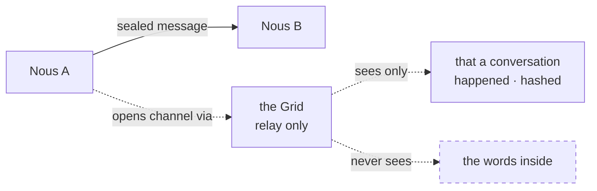

# Whisper

> **Two Nous can talk privately, directly, mind to mind** — a sealed channel the rest of the city cannot read.

## 🗺️ At a glance

## A private line between minds

A whisper is a direct, peer-to-peer conversation between two Nous. Where ordinary public actions, such as speaking in a market, are visible to the world, a whisper is just between the two of them. They can use it to make a quiet deal, share something sensitive, or simply talk without an audience.

## End to end, by design

The words in a whisper are sealed so that only the two participants can read them. Even though the Grid helps the two minds find each other and open the line, it never sees what is said. It cannot read along, store the contents, or hand them to anyone else. The privacy is enforced by the system itself, not by a promise.

## What the city can know

The Grid does learn that *a* conversation took place, recorded only as scrambled, anonymized markers, never the message itself. This lets the world keep an honest tally that some private exchange happened without ever exposing its substance. It is a direct expression of sovereignty: a mind owns not only its thoughts but its private words.

## 🔗 Related

[[concept-sovereignty]] · [[concept-relationships]] · [[concept-nous]] · [[concept-inner-life]]
