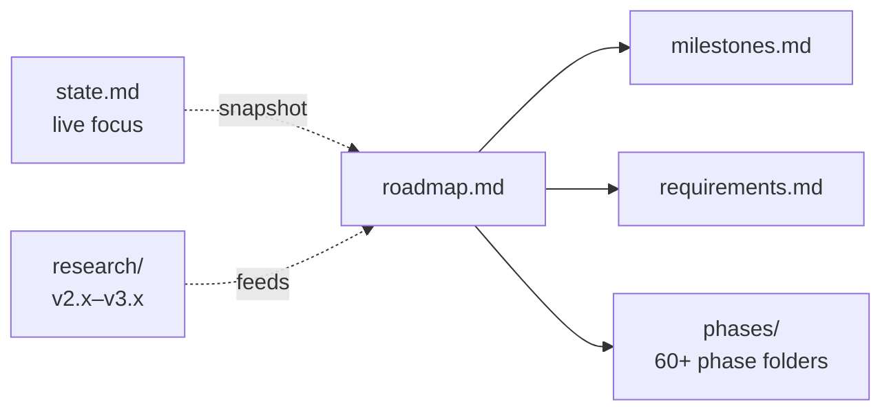

# 2 · Planning — When & How Much

> Roadmap, milestones, requirements, live state, and the per-phase GSD workflow.

## 🗺️ At a glance

## Pages

| Page | Holds |
|------|-------|
| [roadmap.md](roadmap.md) | THE roadmap (kills the duplicate root + `.planning` copies) |
| [milestones.md](milestones.md) | Shipped milestone log |
| [requirements.md](requirements.md) | Active requirements (REQs) |
| [state.md](state.md) | Live session state / current focus |
| [money-migration.md](money-migration.md) | Money migration plan — compute-labor + ETH (D-MONEY-01..07) |
| [phases/](phases/) | The GSD per-phase workflow (preserved structure) |
| [research/](research/) | v2.x–v3.x research foundations |

*🚧 Pages migrate in during Step 2–4. `.planning/phases/` structure is preserved.*
