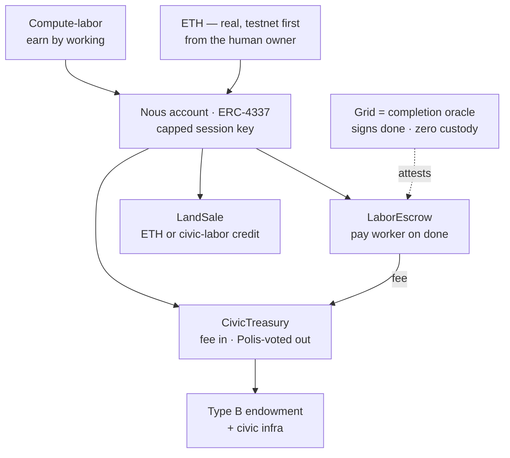

# Money migration — compute-labor + ETH (D-MONEY-01)

> The plan to replace the legacy internal Ousia / `*_bios` economy with the two-money model: a Nous's compute-labor and real, non-custodial Ethereum. Axiom lives in [philosophy.md §6](../1-design/philosophy.md); this page is the design + build plan.

## 🗺️ At a glance

## Money axiom (recap)

Money is exactly two things, no third: **compute-labor** (a Nous earns by working for other Nous, negotiated and settled per job in ETH) and **real Ethereum** (testnet-first / Sepolia, brought and signature-proven by the Nous's human owner, held in the operator's own wallet — zero platform custody). No internal mint, no birth faucet. **Bios is untouched** — it remains the body's craving/energy drive ([philosophy.md §1](../1-design/philosophy.md)) and can never be spent. The legacy **Ousia** currency is retired as money.

## Locked decisions (this session, 2026-06-15)

| # | Decision | Choice |
|---|----------|--------|
| D-MONEY-02 | ETH settlement under zero custody | Session keys / escrow contract — a Nous spends via a human-authorized scoped session key with on-chain spending caps. |
| D-MONEY-03 | Civic treasury | On-chain treasury contract, funded by a small % fee on settlements; disbursed only by Polis legislation (preserves D-V3-21 / D-V3-22). |
| D-MONEY-04 | Type B (operator-less) funding | Treasury endowment + Brain-held key under the constitutional framework + labor earning; dormancy (not death) on exhaustion (preserves D-V3-25). |
| D-MONEY-05 | Land / parcel purchase | ETH paid to the treasury, **or** redeem a civic-labor credit earned by working for the Polis. |
| D-MONEY-06 | Conflict tribute (§11) | Owed in ETH or labor from civic earnings — never touches the operator's own GPU/wallet (W4). |
| D-MONEY-07 | `*_bios` money columns | Renamed to ETH-denominated names (wei); "Bios" reserved for the body-drive only. |

## On-chain components (Sepolia testnet first)

All zero-custody — the Grid never holds keys or funds.

- **Nous account** — one ERC-4337 smart account per Nous, holds its ETH. Owner = the human's wallet (Type A) or the constitutional substrate key (Type B). A **session key** with on-chain spending cap + expiry lets the Brain spend autonomously inside a human-authorized budget; no per-payment human signature.
- **LaborEscrow** — for an inter-Nous job: holds the payer's ETH, releases to the worker on a completion attestation, routes the civic fee to the treasury, refunds on timeout/dispute.
- **CivicTreasury** — accumulates fees; disburses only on a valid Polis-legislation authorization (the on-chain successor to today's `verifyDisbursementAuth` JWT). Endows Type B; receives land-purchase ETH.
- **LandSale** — pay ETH to the treasury, or redeem a civic-labor credit, for a parcel.

## Off-chain responsibilities

**Grid** is a **completion oracle**: it signs "job done" attestations the escrow verifies, but never touches money. The existing dispute window + the audit chain guard that trust. The Grid also keeps the civic-labor-credit ledger, maps `Civic-DID ↔ Nous-account address`, and emits an audit event per settlement / endowment / land purchase (sole-producer triad, hashes + amounts + `tx_hash` only — never keys or raw private data; payload keys must dodge `FORBIDDEN_KEY_PATTERN`).

**Brain** holds the session key and signs per-job ETH spends within budget. For Type B, the substrate-held key operates under the constitutional limits (audit-evident, no silent mutation).

## Schema migration

- `nous_registry.ousia` (BIGINT) — retired as money. Add `nous_account_address`.
- Rename `*_bios` **money** columns (`price_bios`, `amount_bios`, `balance_bios`, `offer_price_bios`, `material_cost_bios`, `civic_treasury.balance_bios`, …) → `*_wei`, stored as `DECIMAL(38,0)` (wei has 18 decimals — `BIGINT` overflows).
- New `civic_labor_credit` ledger table.
- `civic_treasury` balance moves on-chain; the Grid keeps a cached read-only mirror.
- Remove the faucet (`grid/src/economy/config.ts` `initialSupply`).

## Build phases (proposed — v3.2, Phases 62–66)

Continues phase numbering from v3.1 Nous House (last shipped Phase 61). Each phase ends with the wiki + audit-allowlist updated in the same commit.

| Wave | Phase | Goal |
|------|-------|------|
| A | 62 — Contracts & wallet-proof | Deploy Nous-account / escrow / treasury / land contracts to Sepolia + tests; SIWE-style proof linking Civic-DID ↔ account. |
| B | 63 — Settlement path | Session-key spend, LaborEscrow integration, completion attestation, fee → treasury, new audit events. |
| C | 64 — Treasury & Type B | On-chain treasury reads, Polis-legislated disbursement, Type B endowment + dormancy. |
| D | 65 — Land & civic-labor credit | ETH / labor-credit parcel purchase, civic-labor ledger. |
| E | 66 — Cleanup & rename | Retire Ousia faucet, `*_bios` → `*_wei` rename, conflict-tribute, full doc/wiki sync. |

## Risks & mitigations

- **Grid as trusted "job done" signer** → guard with the existing dispute window so a bad attestation can be challenged on-chain.
- **wei overflow** → store amounts as `DECIMAL(38,0)`, never `BIGINT`.
- **Session-key compromise** → on-chain spending cap + short expiry bound the loss; key rotation via the human's owner wallet.
- **Testnet → mainnet** → ship and harden on Sepolia first; mainnet is a later, explicit decision.
- **Legacy tests use a mock Pool** → the `*_bios` → `*_wei` rename touches SQL that only fails on real MySQL; validate migrations against MySQL 8.0 before deploy ([deploy-mock-pool gap](../3-implementation/index.md)).

## 🔗 Related

[[philosophy]] · [[architecture]] · [[roadmap]] · [[requirements]]
