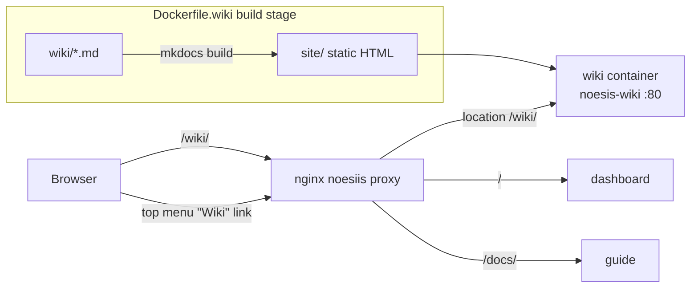

# Wiki Hosting — served from Noēsis at `/wiki/`

> The wiki ships as a static container behind the Noēsis reverse proxy, linked from the app's top menu. Edit markdown → rebuild image → it's live at `${DOMAIN}/wiki/`.

## 🗺️ At a glance



## How it works

| Piece | File |
|-------|------|
| Container (multi-stage: `mkdocs build` → nginx) | [`docker/Dockerfile.wiki`](https://github.com/) `docker/Dockerfile.wiki` |
| Static server config (serves `/wiki/`, healthz, caching) | `docker/nginx.wiki.conf` |
| Reverse-proxy route (`upstream noesis_wiki` + `location /wiki/`) | `docker/nginx.noesiis.conf.template` |
| Service definition (AWS / nginx topology) | `docker-compose.aws.yml` → `wiki` service |
| Service definition (prod / Traefik topology) | `docker-compose.prod.yml` → `wiki` (PathPrefix `/wiki`, priority 50) |
| Top-menu link | `dashboard/src/app/LandingView.tsx` → `<a href="/wiki/">Wiki</a>` |

## Updating the live wiki

1. Edit markdown under `wiki/` (follow [PROTOCOL](../PROTOCOL.md)).
2. Rebuild + redeploy the `wiki` container (deploy is **operator-initiated**, never automatic — see deploy guardrail).
3. The static site is regenerated from markdown at image build time; no hand-edited HTML.

## Local preview (no Docker)

```bash
scripts/wiki.sh serve      # http://localhost:8000
```

Subpath serving verified: pages + relative assets resolve correctly under `/wiki/`.

## 🔗 Related

[PROTOCOL](../PROTOCOL.md) · [implementation index](index.md)
