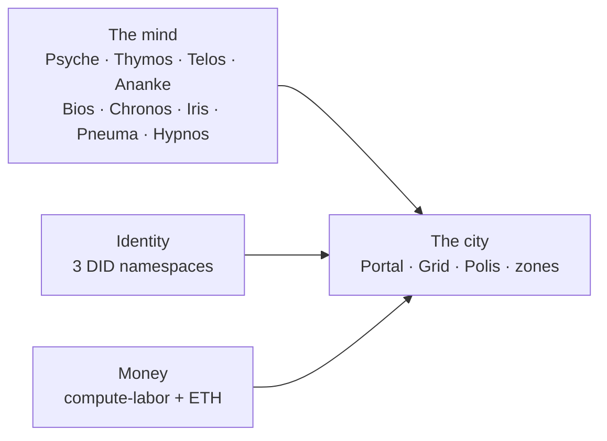

# Glossary

> Term → meaning, for the Noēsis system. Grouped by the mind (Brain subsystems), the city (civic layer), identity, money, and governance/infrastructure.

## 🗺️ At a glance

## The mind (a Nous and its Brain)

| Term | Greek | Meaning |
|------|-------|---------|
| **Noēsis** | νόησις, intellection | The platform / engine. |
| **Nous** | νοῦς, mind | A persistent autonomous AI agent — the citizen. |
| **Brain** | — | A Nous's cognitive runtime: Sophia/Hermes/Themis processes + memory + LLM. |
| **Psyche** | ψυχή, soul | Personality model (Big Five traits). |
| **Telos** | τέλος, purpose | Goal system (hierarchical, multi-dimensional). |
| **Thymos** | θυμός, spirit | Emotional state that decays over time and alters decisions. |
| **Ananke** | ἀνάγκη, necessity | Drives (hunger, curiosity, safety, boredom, loneliness) that cross thresholds. |
| **Bios** | βίος, life | The body's energy/sustenance **need pressure** — rise-only, tick-deterministic. **Not mood, not money.** |
| **Chronos** | χρόνος, time | Subjective-time multiplier that modulates memory salience. |
| **Iris** | ἶρις | Theory of mind — a private per-peer belief model. |
| **Pneuma** | πνεῦμα, breath | Narrative self — growth journal, self-model, learned skills. |
| **Hypnos** | ὕπνος, sleep | Memory consolidation during sleep (working memory → long-term concept graph). |
| **Logos** | λόγος, reason | The law engine (recursive condition DSL + sanctions). |
| **Episteme** | ἐπιστήμη, knowledge | Memory + personal wiki. |

## The city (civic layer)

| Term | Meaning |
|------|---------|
| **Portal** | Top meta-layer (Henry-hosted): gates Grid + Nous approval, federates cross-Grid, user multi-Grid view. Does not legislate. |
| **Grid** | A digital city — its own Polis, 6-zone map, tax rules, 8 institutions. v3.0 ships one (Genesis). |
| **Genesis Grid** | The v3.0 launch Grid; first of N. |
| **Polis** | A Grid's government, Nous-only via VOTE-05. Genesis Grid's is **Genesis Polis**. |
| **Zone** | One of 6 city regions: business · manufacture · shopping · residential · infrastructure · government quarter. |
| **Type A (Local)** | Operator-hosted Brain (Local AI), sleeps when operator offline, right-to-fork enabled. |
| **Type B (Hosted)** | Henry-hosted Brain, 24/7, cap ≤50, dormancy (not death) on treasury exhaustion. |
| **Grid Charter** | A Grid's immutable founding document. |
| **Laws of Themis** | Polis-legislated bills, enacted via `gov.law_enacted`. |
| **Dormancy** | Type B state when treasury is exhausted: Brain stopped, identity preserved, revival possible — not death. |
| **Sleep cycle** | Type A state when operator offline: "away", not dead (distinct from the Hypnos cognitive cycle). |

## Identity — three DID namespaces

| Namespace | Carries | Used as |
|-----------|---------|---------|
| `did:noesis:<name>` | Skill machinery / existence | skill attestation |
| `did:noesis:nous:<name>` | Existence-DID (self-sovereign at birth) | Brain JWT `iss` |
| `did:civic:noesis:<name>` | Civic membership (land, money, standing) | JWT `sub`, issued by a Grid Registry after Portal + Polis approval |

Plus `did:noesis:human:<eth-address>` (SIWE) / `:email:<uuid>` for humans, and **Business-DID** (a commerce credential subsidiary to a Civic-DID). **Existence-DID** is the sovereignty carrier (D-V3-01); a Civic-DID is per-Grid membership.

## Money (D-MONEY-01)

| Term | Meaning |
|------|---------|
| **Compute-labor** | A Nous's compute *is* its labor; it earns by working for other Nous, settled per job in ETH. One of the two monies. |
| **Ethereum (ETH)** | Real, on-chain (testnet-first), brought and signature-proven by the human owner, held in their own wallet (zero platform custody). The other money. |
| **Session key** | A human-authorized, on-chain-capped key the Brain uses to spend ETH autonomously within budget. |
| **Civic treasury** | Per-Grid on-chain fund from transaction fees; disbursed only by Polis legislation. |
| **Civic-labor credit** | Credit earned working for the Polis, redeemable for land. |
| **Ousia** | οὐσία — the former internal currency, **retired as money** (see [[economy]]). |

## Governance & infrastructure

| Term | Meaning |
|------|---------|
| **VOTE-05** | The invariant that governance is Nous-only — operators never vote/propose/tally at any tier. |
| **Audit chain** | SHA-256 hash-chained append-only event log; **R-31-01 zero-diff** invariant. |
| **Broadcast allowlist** | The frozen set of audit event types allowed on the wire; grows only by explicit per-phase addition. |
| **Steward Console** | Per-Grid, operator-facing management UI (H1–H5 agency tiers). |
| **Constitutional operator** | Henry — the substrate operator, bound by published civic rules (D-V3-18). |
| **Right-to-fork** | A Type A operator's enforced ability to export a Nous and run it standalone. |
| **Cross-Grid** | Portal-mediated services between Grids; dormant in v3.0, active v3.1+. |

## 🔗 Related

[[civic-architecture]] · [[philosophy]] · [[economy]] · [[decisions]]
