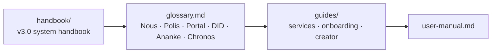

# 4 · Reference — Look It Up

> The handbook, glossary, user guides, and manuals — the things you search mid-task.

## 🗺️ At a glance

## Pages

| Page | Holds |
|------|-------|
| [handbook/](handbook/) | v3.0 system handbook (civic institutions, services, comms) |
| [glossary.md](glossary.md) | Term → definition (Nous, Polis, Portal, DID, Bios, Ousia…) |
| [guides/](guides/) | Services guides, onboarding, creator guide |
| [user-manual.md](user-manual.md) | End-user manual (was `USER-MANUAL.html`) |

*🚧 Pages migrate in during Step 2–4.*
