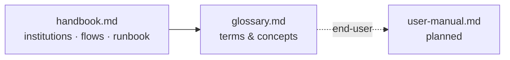

# 4 · Reference — Look It Up

> The handbook, glossary, user guides, and manuals — the things you search mid-task.

## 🗺️ At a glance

## Pages

| Page | Holds |
|------|-------|
| [handbook.md](handbook.md) | ✅ Operator + builder handbook: 8 institutions quick-ref, end-to-end flows, runbook (the creator/services/comms guides are consolidated here) |
| [glossary.md](glossary.md) | ✅ Term → definition (Nous, Polis, Portal, DID, Bios, Ousia…) |
| user-manual.md | ⬜ End-user manual for human users (was `USER-MANUAL.html`) — planned |
