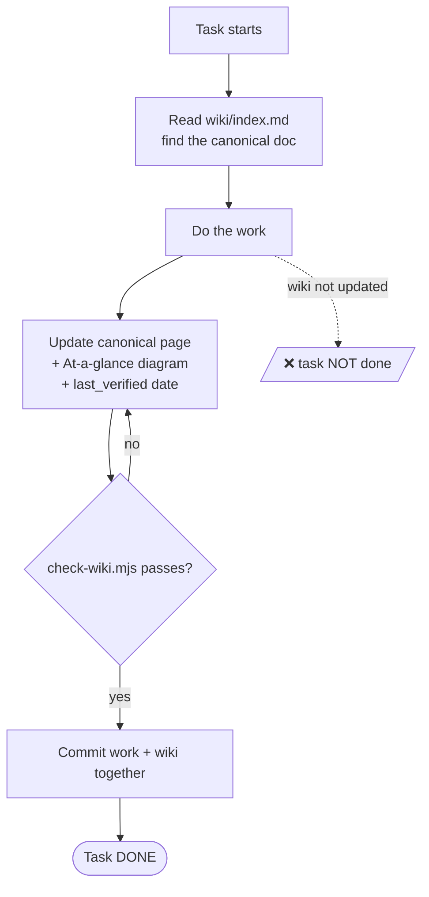
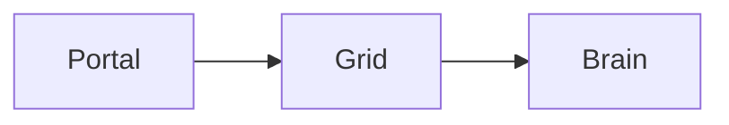

# Wiki Protocol — Follow & Update

> **The wiki only stays trustworthy if it is read first and updated every task.** This page is the contract for both Henry and Claude.

## Scope — what belongs here (D-WIKI-06)

This wiki is **knowledge about the Noēsis _system_** — for *understanding* it, not *building* it (D-WIKI-07): philosophy, concepts, structure, design, object/entity details, system architecture, and system flows. The reader encyclopedia ([2 · Concepts](2-concepts/index.md)) is the heart.

**Development & implementation docs are NOT here.** Component internals, migrations, CI gates, deploy, and contracts live privately in [`.planning/implementation/`](../.planning/implementation/) — in-repo only, never served.

The **developer _process_** — roadmap, milestones, requirements, current scope, session state, decisions/discussion, phases, steps, progress, logs — lives privately in [`.planning/`](../.planning/) **in-repo only and is never served here**. When a decision lands in `.planning/`, its resulting *system truth* is distilled onto the relevant wiki page; the *sequencing, debate, and progress* stay in `.planning/`. **Process docs never enter this wiki.**

| Belongs in the wiki (system) | Belongs in `.planning/` (process) |
|------------------------------|-----------------------------------|
| philosophy · concepts · invariants | roadmap · milestones |
| architecture · structure · flows | requirements · current scope · state |
| object/entity & technical details | phases · build plans · steps · progress |
| the decision *log* (what is true now) | the decision *discussion* · session logs |

## 🗺️ At a glance



## The loop (mandatory)

1. **Read-first.** Open [`wiki/index.md`](index.md) at the start of every session/task to locate the canonical doc for what you're touching.
2. **Do the work.**
3. **Update-after.** Update the canonical page(s) the change affects — body **and** the `## At a glance` diagram — and bump `last_verified`. This is the [Documentation Sync Rule](../CLAUDE.md) made mechanical.
4. **Same commit.** Wiki edits ship in the **same commit** as the work they describe.
5. **Completion gate (requirement).** A task is **not complete**, and must not be claimed complete, until the wiki reflects it.

## Page invariants (CI: `scripts/check-wiki.mjs`)

| # | Rule | Decision |
|---|------|----------|
| 1 | Every page has front-matter with `status` | D-WIKI-04 |
| 2 | Every `live`/`draft` page has an `## At a glance` Mermaid diagram | D-WIKI-05 |
| 3 | At most **one** `canonical: true` page per `topic` | D-WIKI-04 |
| 4 | A `superseded` page is a stub with a `moved_to:` pointer, no body | D-WIKI-03 |

> The gate runs `scripts/wiki.sh check`. It is **advisory** during migration (`ENFORCED=false`) and flips to **blocking** at migration Step 6.

## Front-matter schema

```yaml
---
canonical: true              # this IS the source of truth for its topic
topic: civic-architecture    # the unique topic key (one canonical per topic)
supersedes: [planning/ARCHITECTURE.md]   # old paths now redirecting here
status: live                 # live | draft | superseded | archived
last_verified: 2026-06-14
owners: [henry, claude]
---
```

## Page template

Copy this for any new page:

```markdown
---
canonical: true
topic: <key>
status: live
last_verified: 2026-06-14
owners: [henry, claude]
---
# <Title>
> One-line purpose.
## 🗺️ At a glance

## Details
...
## 🔗 Related
[[architecture]] · [[decisions]]
```
