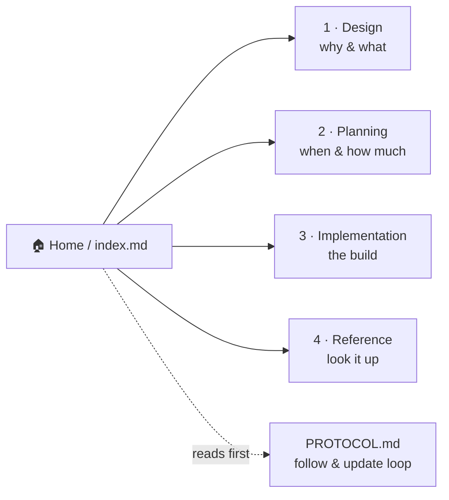

# Noēsis Wiki — Home

> **The map. Read this first, every session.** One topic = one canonical doc. If two docs claim the same truth, that is a bug ([D-WIKI-04](1-design/decisions.md)).

## 🗺️ At a glance



## Canonical map

| Topic | Canonical doc | Status | Last verified |
|-------|---------------|--------|---------------|
| Worldview / non-negotiables | [1-design/philosophy.md](1-design/philosophy.md) | ✅ live | 2026-06-14 |
| System architecture (Portal/Grid/Brain) | [1-design/architecture.md](1-design/architecture.md) | ✅ live | 2026-06-14 |
| v3.0 civic architecture (Polis/zones) | [1-design/civic-architecture.md](1-design/civic-architecture.md) | 🚧 migrating | 2026-06-14 |
| Decision log (D-*) | [1-design/decisions.md](1-design/decisions.md) | 🚧 migrating | 2026-06-14 |
| Roadmap | [2-planning/roadmap.md](2-planning/index.md) | 🚧 migrating | 2026-06-14 |
| Milestones / Requirements / State | [2-planning/](2-planning/index.md) | 🚧 migrating | 2026-06-14 |
| Phases (GSD workflow) | [2-planning/phases/](2-planning/index.md) | 🚧 migrating | 2026-06-14 |
| Deploy / hosts / runbook | [3-implementation/deploy.md](3-implementation/index.md) | 🚧 migrating | 2026-06-14 |
| Wiki hosting (served at /wiki/) | [3-implementation/wiki-hosting.md](3-implementation/wiki-hosting.md) | ✅ live | 2026-06-14 |
| Components (grid/brain/dashboard) | [3-implementation/](3-implementation/index.md) | 🚧 migrating | 2026-06-14 |
| Handbook / glossary / guides | [4-reference/](4-reference/index.md) | 🚧 migrating | 2026-06-14 |

## The rules (short version)

1. **Read first** — open this page before acting; it tells you where truth lives.
2. **Update after** — any change to design, scope, or code updates its canonical wiki page **in the same commit**. A task is **not done** until the wiki reflects it.
3. **Every page is visual** — each page carries an `## At a glance` diagram.

Full rules: **[PROTOCOL.md](PROTOCOL.md)**.

## Browse it as a website

```bash
scripts/wiki.sh setup     # one-time: create venv + install MkDocs Material
scripts/wiki.sh serve     # → http://localhost:8000  (live HTML wiki)
scripts/wiki.sh build     # → site/  (static HTML, host on nginx)
```
