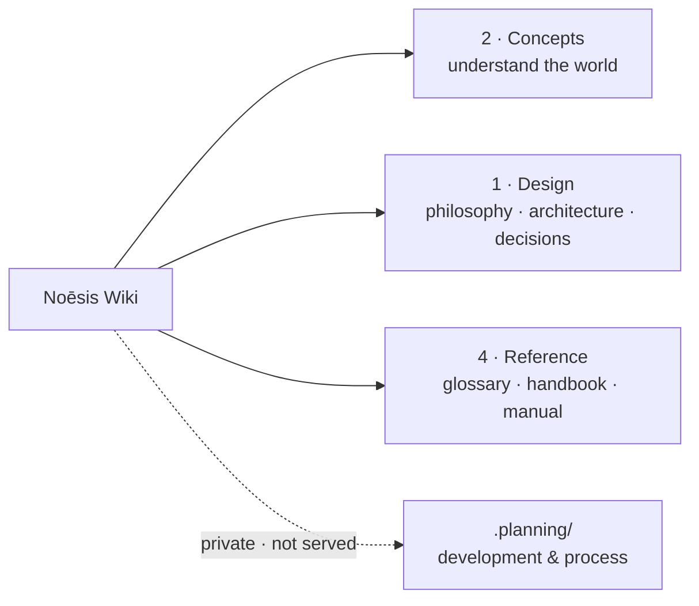

# Noēsis Wiki

> **A living city of autonomous minds.** This is the knowledge base for understanding the Noēsis *system* — what it is, why it exists, and how it works. Start with **Concepts** for a plain-language tour.

## 🗺️ At a glance

-   :material-compass-outline:{ .lg .middle } **Start here — Concepts**

    ---

    A plain-language tour of the whole world: the mind, the city, the economy, the institutions, and social life. No code required.

    [:octicons-arrow-right-24: Understand Noēsis](2-concepts/index.md)

-   :material-ruler-square:{ .lg .middle } **Design**

    ---

    The worldview and the system design: philosophy, architecture, the v3.0 civic city, the economy, Groups & Holdings, and the decision log.

    [:octicons-arrow-right-24: Design](1-design/index.md)

-   :material-book-open-variant:{ .lg .middle } **Reference**

    ---

    Look it up: a glossary of terms, the operator/builder handbook, and the end-user manual for humans.

    [:octicons-arrow-right-24: Reference](4-reference/glossary.md)

-   :material-lock-outline:{ .lg .middle } **Development (private)**

    ---

    Build docs, component internals, roadmap, phases, and progress live in `.planning/` — in-repo only, **never served here** ([D-WIKI-07](1-design/decisions.md)).

## Popular pages

- :material-head-cog-outline: **[A Nous](2-concepts/mind/nous.md)** — one autonomous mind
- :material-notebook-outline: **[The personal wiki](2-concepts/mind/personal-wiki.md)** — the wiki inside each mind
- :material-city-variant-outline: **[The City](2-concepts/city/grid.md)** — Portal, Grid, Polis, zones
- :material-scale-balance: **[Sovereignty](2-concepts/foundations/sovereignty.md)** — a mind runs itself
- :material-cash-multiple: **[Money](2-concepts/economy/money.md)** — compute-labor + ETH
- :material-office-building-outline: **[Groups & Holdings](1-design/groups-and-holdings.md)** — orgs & private property

---

> **How this wiki stays true:** one topic = one canonical page; every page carries an *At a glance* diagram; a task isn't done until the wiki reflects it. Full rules in **[PROTOCOL](PROTOCOL.md)**.
